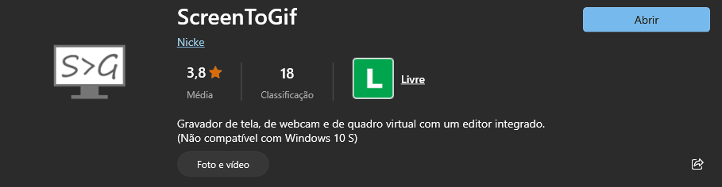

# Projeto com README
Um projeto de teste com um arquivo README😜

[](https://google.com)

## Tecnologias utilizadas
- HTML
- CSS
- JavaScript

## Como utilizar

1 - Clone pro projeto
```
git clone <url>
```

2 - Acesse a pasta do projeto
```
cd repositorio-com-readme
```


| Tabelas  | São       | Legais |
| ---------|:----------| ------:|
| sim      | é         | ta     |
| não      | bem       | vendo  |
| talvez   | legal     | ?      |

